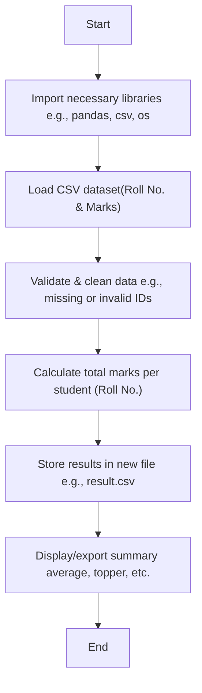

# Mini-Project-Marks-Adding
Marks Adding System is a scalable Python tool that automates score aggregation from CSV files. It reads roll numbers or candidate IDs, calculates total marks and exports the results. Ideal for academic institutions, training programs, online test platforms and recruitment bodies handling bulk evaluations.

## Project Structure

## Aim

## Industrial Applications
- Educational Institutes: Exam and internal assessment score processing
- Corporate Training: Skill test score aggregation across sessions
- EdTech Platforms: Backend for test evaluation and analytics
- Recruitment Agencies: Score tabulation across multi-stage evaluations

## Future Enhancements
- Add grading (A/B/C based on marks)
- Visualize data using bar/pie charts
- Add web or GUI interface using Tkinter/Streamlit
- Integrate into school ERP systems

